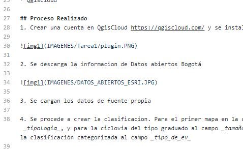

# TAREA 1

## Cuál es el problema a tratar?

Para el primer mapa, esta enfocado en determinar los lugares para poder guardar las bicicletas, bien sea en ciclovia o por cualquier día de la semana. Para ello los lugares mostrados son los cicloparqueaderos habilitados en bogotá, ayudado de las rutas de ciclovia, sombreadas por tramo en mayoria de distancía una de la otra.

Para el segundo mapa, es una visualización simple de los lugares minados descubiertos en Colombia, clasificados por los tipos de eventos determinados en cada uno: Accidente por MAP, Accidente por MUSE,Desminado militar en operaciones, Sospecha de campo minado

## Por qué un mapa ayuda a resolverlo?

Para los usuarios frecuentes del medio de transporte que es la bicicleta, es importante tener una referencia de los sitios en Bogotá en el que se pueda dejar guardada la bicicleta por cualquier tipo de evento, ya sea por medio de transporte diario, o por cambio de clima, o algún percance. 

Para el segundo mapa, es importante tener conocimiento de las zonas con mayor cantidad de minas y sus actividades recientes, más para el caso de los campesinos o personas que viajan regularmente a ciertos lugares del territorio nacional.

## Fuente de datos

_mapa 1_ Datos abiertos Bogotá http://datosabiertos.bogota.gov.co/

_mapa 2_ Fuente obtenida en oficina

## Herramientas

* QGis 
* Qgiscloud

## Proceso Realizado
1. Crear una cuenta en QgisCloud https://qgiscloud.com/ y se instala el plugin de Qgiscloud

2. Se descarga la informacion de Datos abiertos Bogotá

3. Se cargan los datos de fuente propia

4. Se procede a crear la clasificacion. Para el primer mapa en la capa de cicloparqueaderos se aplica del tipo categorizado al campo  _tipologia_, y para la ciclovia del tipo graduado al campo _tamaño_tr_. Para el segundo mapa, a la capa de eventos mineros, se aplica la clasificación categorizada al campo _tipo_de_ev_

5. Generamos la simbologia adecuada para la representacion.

6. Acedemos a la cuenta creada, continuamente creamos la base de datos.

7. Cargamos los datos vectoriales presente en el proyecto del Qgis al servidor QgisCloud

8. Como ultimo paso publicamos el proyecto con la representacion simbolica definida en el proyecto

### Urls

* mapa 1: https://qgiscloud.com/hectorcas85/mapa1/
* mapa 1 WMS: https://wms.qgiscloud.com/hectorcas85/mapa1/
* mapa 2: https://qgiscloud.com/hectorcas85/mapa2/
* mapa 2 WMS: https://wms.qgiscloud.com/hectorcas85/mapa2/
