## Cuál es el problema a tratar?

Se tienen unos puntos de instalaciones mineras por todo el territorio nacional, y se pretende realizar un cruce de información contra amenaza sísmica en Colombia, con el objetivo de establecer que lugares de esas instalaciones puede existir riesgos sísmicos, para poder establecer operaciones de control en caso de actividades de ese tipo.

## Por qué la publicación de servicios OGC puede ayudar a resolverlo?

Para las entidades, tener ese tipo de información a la mano, mediante un simple link, permite desde cualquier lugar con una simple conexión a internet, en algún caso de actividad sísmica posibles soluciones inmediatas.

## Qué servicios propone para la solución de su problema? WMS? WMTS? WFS? Por qué ?

Un simple wms seria bastante, ya que solo con la visualización de la información, además de que no tiene un gran número de registros con el que pueda requerir mucha banda de internet, es posible observar lo que se desea, por ende un WMTS tampoco seria necesario.


## Descripción de los datos seleccionados (Origen, descripción, características especiales, atributos, url para descarga)

* La capa de instalación minera es un insumo obtenido por una empresa en la que laboré. Contiene la información de los nombres de las mineras
* La capa de amenaza sísmica viene de la misma empresa ambiental. Contiene niveles de amenaza (alta, intermedia, baja) en los sitios de Colombia
* La capa departamentos ya se encontraba en el geoserver, por lo que no vi la necesidad de subir otra igual.

## Descripción del procesamiento realizado con postgis (Incluir los sqls)

__Subimos las capas con el administrador de bases de datos que tiene el Qgis.__

1. Se cargan las capas a Qgis

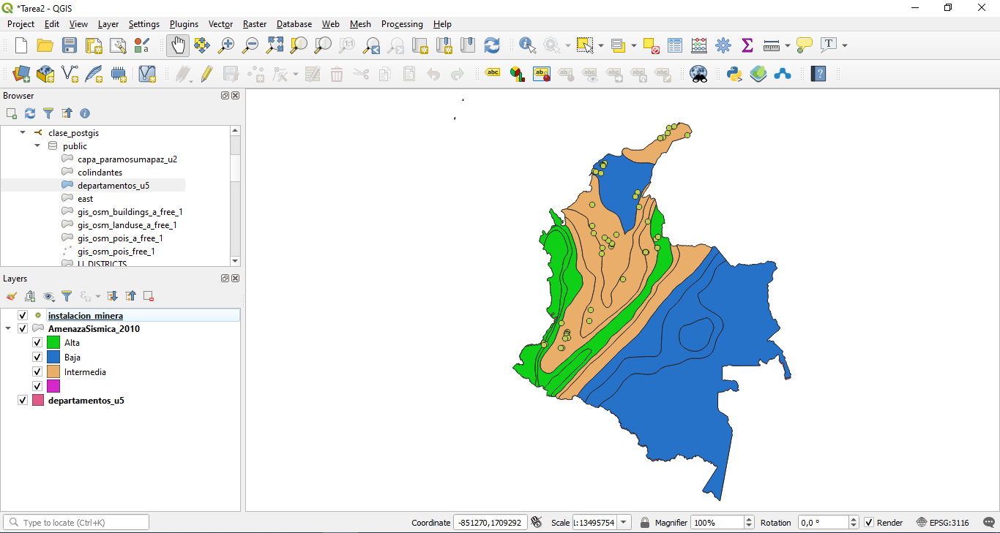

2. Se cargan con la herramienta DB Manager a la base de datos de la clase 

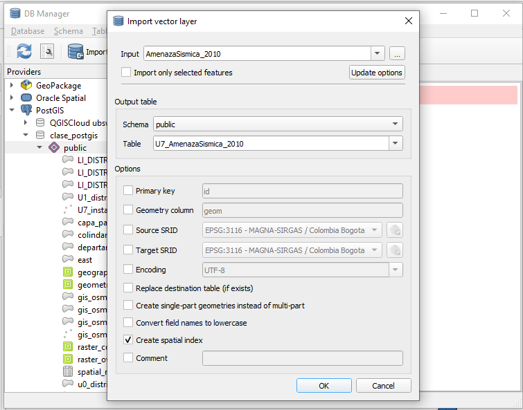

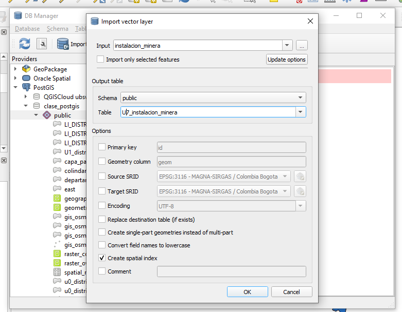

3. Ya con las capas subidas, se realiza una consulta espacial para intersecte la información de instalaciones con las demas capas.

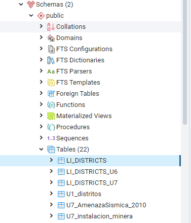

El código es el siguiente

```sql
alter table u7_inst_minera_wgs84 add column dpto character varying;
alter table u7_inst_minera_wgs84 add column amenaza character varying;

update u7_inst_minera_wgs84 set dpto = departamentos_u5.nombre
from departamentos_u5
where st_intersects(u7_inst_minera_wgs84.geom, departamentos_u5.geom)

update u7_inst_minera_wgs84 set amenaza = u7_amenazasismica_wgs84.gradoamena
from u7_amenazasismica_wgs84
where st_intersects(u7_inst_minera_wgs84.geom, u7_amenazasismica_wgs84.geom)
```

El resultado a los campos creados con la intersección es:

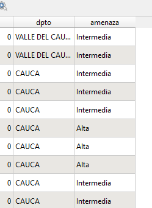


## Descripción de la forma en que creó la simbología (incluir los sld's y css)

1. En Qgis se define la simbologia de los shapes:

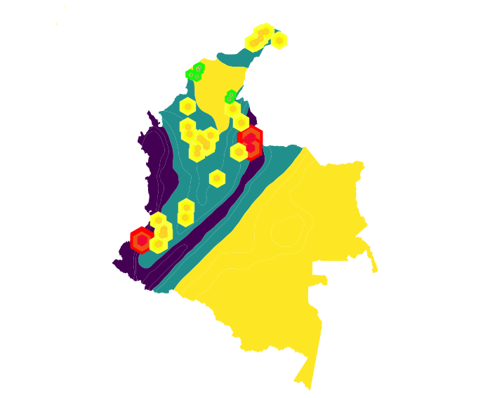

2. Con esto, se guarda la simbologia al estidlo SLD y CSS

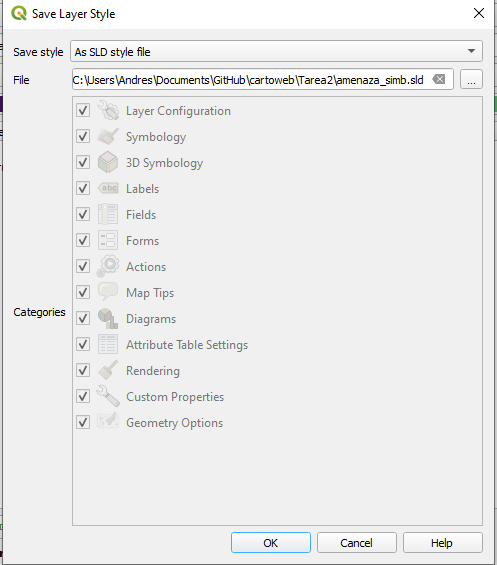

__Estilo Instalaciones__

```xml
<?xml version="1.0" encoding="UTF-8"?>
<StyledLayerDescriptor xmlns="http://www.opengis.net/sld" xmlns:xsi="http://www.w3.org/2001/XMLSchema-instance" xmlns:se="http://www.opengis.net/se" xmlns:ogc="http://www.opengis.net/ogc" xmlns:xlink="http://www.w3.org/1999/xlink" version="1.1.0" xsi:schemaLocation="http://www.opengis.net/sld http://schemas.opengis.net/sld/1.1.0/StyledLayerDescriptor.xsd">
  <NamedLayer>
    <se:Name>u7_inst_minera_wgs84</se:Name>
    <UserStyle>
      <se:Name>u7_inst_minera_wgs84</se:Name>
      <se:FeatureTypeStyle>
        <se:Rule>
          <se:Name>Alta</se:Name>
          <se:Description>
            <se:Title>Alta</se:Title>
          </se:Description>
          <ogc:Filter xmlns:ogc="http://www.opengis.net/ogc">
            <ogc:PropertyIsEqualTo>
              <ogc:PropertyName>amenaza</ogc:PropertyName>
              <ogc:Literal>Alta</ogc:Literal>
            </ogc:PropertyIsEqualTo>
          </ogc:Filter>
          <se:PointSymbolizer>
            <se:Graphic>
              <se:Mark>
                <se:WellKnownName>hexagon</se:WellKnownName>
                <se:Fill>
                  <se:SvgParameter name="fill">#ed5214</se:SvgParameter>
                </se:Fill>
                <se:Stroke>
                  <se:SvgParameter name="stroke">#ff0004</se:SvgParameter>
                  <se:SvgParameter name="stroke-width">4</se:SvgParameter>
                </se:Stroke>
              </se:Mark>
              <se:Size>31</se:Size>
            </se:Graphic>
          </se:PointSymbolizer>
          <se:PointSymbolizer>
            <se:Graphic>
              <se:Mark>
                <se:WellKnownName>hexagon</se:WellKnownName>
                <se:Fill>
                  <se:SvgParameter name="fill">#ed0731</se:SvgParameter>
                </se:Fill>
                <se:Stroke>
                  <se:SvgParameter name="stroke">#fa1121</se:SvgParameter>
                  <se:SvgParameter name="stroke-width">1</se:SvgParameter>
                </se:Stroke>
              </se:Mark>
              <se:Size>13</se:Size>
            </se:Graphic>
          </se:PointSymbolizer>
        </se:Rule>
        <se:Rule>
          <se:Name>Intermedia</se:Name>
          <se:Description>
            <se:Title>Intermedia</se:Title>
          </se:Description>
          <ogc:Filter xmlns:ogc="http://www.opengis.net/ogc">
            <ogc:PropertyIsEqualTo>
              <ogc:PropertyName>amenaza</ogc:PropertyName>
              <ogc:Literal>Intermedia</ogc:Literal>
            </ogc:PropertyIsEqualTo>
          </ogc:Filter>
          <se:PointSymbolizer>
            <se:Graphic>
              <se:Mark>
                <se:WellKnownName>hexagon</se:WellKnownName>
                <se:Fill>
                  <se:SvgParameter name="fill">#f7ff00</se:SvgParameter>
                </se:Fill>
                <se:Stroke>
                  <se:SvgParameter name="stroke">#faff39</se:SvgParameter>
                  <se:SvgParameter name="stroke-width">4</se:SvgParameter>
                </se:Stroke>
              </se:Mark>
              <se:Size>21</se:Size>
            </se:Graphic>
          </se:PointSymbolizer>
          <se:PointSymbolizer>
            <se:Graphic>
              <se:Mark>
                <se:WellKnownName>hexagon</se:WellKnownName>
                <se:Fill>
                  <se:SvgParameter name="fill">#ffd529</se:SvgParameter>
                </se:Fill>
                <se:Stroke>
                  <se:SvgParameter name="stroke">#fac424</se:SvgParameter>
                  <se:SvgParameter name="stroke-width">1</se:SvgParameter>
                </se:Stroke>
              </se:Mark>
              <se:Size>9</se:Size>
            </se:Graphic>
          </se:PointSymbolizer>
        </se:Rule>
        <se:Rule>
          <se:Name>Baja</se:Name>
          <se:Description>
            <se:Title>Baja</se:Title>
          </se:Description>
          <ogc:Filter xmlns:ogc="http://www.opengis.net/ogc">
            <ogc:PropertyIsEqualTo>
              <ogc:PropertyName>amenaza</ogc:PropertyName>
              <ogc:Literal>Baja</ogc:Literal>
            </ogc:PropertyIsEqualTo>
          </ogc:Filter>
          <se:PointSymbolizer>
            <se:Graphic>
              <se:Mark>
                <se:WellKnownName>hexagon</se:WellKnownName>
                <se:Fill>
                  <se:SvgParameter name="fill">#40d938</se:SvgParameter>
                </se:Fill>
                <se:Stroke>
                  <se:SvgParameter name="stroke">#17fa06</se:SvgParameter>
                  <se:SvgParameter name="stroke-width">4</se:SvgParameter>
                </se:Stroke>
              </se:Mark>
              <se:Size>11</se:Size>
            </se:Graphic>
          </se:PointSymbolizer>
          <se:PointSymbolizer>
            <se:Graphic>
              <se:Mark>
                <se:WellKnownName>hexagon</se:WellKnownName>
                <se:Fill>
                  <se:SvgParameter name="fill">#40d938</se:SvgParameter>
                </se:Fill>
                <se:Stroke>
                  <se:SvgParameter name="stroke">#fab07c</se:SvgParameter>
                  <se:SvgParameter name="stroke-width">1</se:SvgParameter>
                </se:Stroke>
              </se:Mark>
              <se:Size>4</se:Size>
            </se:Graphic>
          </se:PointSymbolizer>
        </se:Rule>
      </se:FeatureTypeStyle>
    </UserStyle>
  </NamedLayer>
</StyledLayerDescriptor>
```

__Estilo Amenaza Sísmica__

```xml
<?xml version="1.0" encoding="UTF-8"?>
<StyledLayerDescriptor xmlns="http://www.opengis.net/sld" xmlns:xsi="http://www.w3.org/2001/XMLSchema-instance" xmlns:se="http://www.opengis.net/se" xmlns:ogc="http://www.opengis.net/ogc" xmlns:xlink="http://www.w3.org/1999/xlink" version="1.1.0" xsi:schemaLocation="http://www.opengis.net/sld http://schemas.opengis.net/sld/1.1.0/StyledLayerDescriptor.xsd">
  <NamedLayer>
    <se:Name>u7_amenazasismica_wgs84</se:Name>
    <UserStyle>
      <se:Name>u7_amenazasismica_wgs84</se:Name>
      <se:FeatureTypeStyle>
        <se:Rule>
          <se:Name>Alta</se:Name>
          <se:Description>
            <se:Title>Alta</se:Title>
          </se:Description>
          <ogc:Filter xmlns:ogc="http://www.opengis.net/ogc">
            <ogc:PropertyIsEqualTo>
              <ogc:PropertyName>gradoamena</ogc:PropertyName>
              <ogc:Literal>Alta</ogc:Literal>
            </ogc:PropertyIsEqualTo>
          </ogc:Filter>
          <se:PolygonSymbolizer>
            <se:Fill>
              <se:SvgParameter name="fill">#440154</se:SvgParameter>
            </se:Fill>
            <se:Stroke>
              <se:SvgParameter name="stroke">#232323</se:SvgParameter>
              <se:SvgParameter name="stroke-opacity">0</se:SvgParameter>
              <se:SvgParameter name="stroke-width">1</se:SvgParameter>
              <se:SvgParameter name="stroke-linejoin">bevel</se:SvgParameter>
            </se:Stroke>
          </se:PolygonSymbolizer>
        </se:Rule>
        <se:Rule>
          <se:Name>Intermedia</se:Name>
          <se:Description>
            <se:Title>Intermedia</se:Title>
          </se:Description>
          <ogc:Filter xmlns:ogc="http://www.opengis.net/ogc">
            <ogc:PropertyIsEqualTo>
              <ogc:PropertyName>gradoamena</ogc:PropertyName>
              <ogc:Literal>Intermedia</ogc:Literal>
            </ogc:PropertyIsEqualTo>
          </ogc:Filter>
          <se:PolygonSymbolizer>
            <se:Fill>
              <se:SvgParameter name="fill">#20908d</se:SvgParameter>
            </se:Fill>
            <se:Stroke>
              <se:SvgParameter name="stroke">#232323</se:SvgParameter>
              <se:SvgParameter name="stroke-opacity">0</se:SvgParameter>
              <se:SvgParameter name="stroke-width">1</se:SvgParameter>
              <se:SvgParameter name="stroke-linejoin">bevel</se:SvgParameter>
            </se:Stroke>
          </se:PolygonSymbolizer>
        </se:Rule>
        <se:Rule>
          <se:Name>Baja</se:Name>
          <se:Description>
            <se:Title>Baja</se:Title>
          </se:Description>
          <ogc:Filter xmlns:ogc="http://www.opengis.net/ogc">
            <ogc:PropertyIsEqualTo>
              <ogc:PropertyName>gradoamena</ogc:PropertyName>
              <ogc:Literal>Baja</ogc:Literal>
            </ogc:PropertyIsEqualTo>
          </ogc:Filter>
          <se:PolygonSymbolizer>
            <se:Fill>
              <se:SvgParameter name="fill">#fde725</se:SvgParameter>
            </se:Fill>
            <se:Stroke>
              <se:SvgParameter name="stroke">#232323</se:SvgParameter>
              <se:SvgParameter name="stroke-opacity">0</se:SvgParameter>
              <se:SvgParameter name="stroke-width">1</se:SvgParameter>
              <se:SvgParameter name="stroke-linejoin">bevel</se:SvgParameter>
            </se:Stroke>
          </se:PolygonSymbolizer>
        </se:Rule>
      </se:FeatureTypeStyle>
    </UserStyle>
  </NamedLayer>
</StyledLayerDescriptor>
```

__Estilo Departamentos (CSS)__

```css
<?xml version="1.0" encoding="UTF-8"?>
<StyledLayerDescriptor xmlns="http://www.opengis.net/sld" xmlns:xsi="http://www.w3.org/2001/XMLSchema-instance" xmlns:se="http://www.opengis.net/se" xmlns:ogc="http://www.opengis.net/ogc" xmlns:xlink="http://www.w3.org/1999/xlink" version="1.1.0" xsi:schemaLocation="http://www.opengis.net/sld http://schemas.opengis.net/sld/1.1.0/StyledLayerDescriptor.xsd">
  <NamedLayer>
    <se:Name>departamentos_u5</se:Name>
    <UserStyle>
      <se:Name>departamentos_u5</se:Name>
      <se:FeatureTypeStyle>
        <se:Rule>
          <se:Name>AMAZONAS</se:Name>
          <se:Description>
            <se:Title>AMAZONAS</se:Title>
          </se:Description>
          <ogc:Filter xmlns:ogc="http://www.opengis.net/ogc">
            <ogc:PropertyIsEqualTo>
              <ogc:PropertyName>nombre</ogc:PropertyName>
              <ogc:Literal>AMAZONAS</ogc:Literal>
            </ogc:PropertyIsEqualTo>
          </ogc:Filter>
          <se:LineSymbolizer>
            <se:Stroke>
              <se:SvgParameter name="stroke">#d7191c</se:SvgParameter>
              <se:SvgParameter name="stroke-width">3</se:SvgParameter>
              <se:SvgParameter name="stroke-linejoin">bevel</se:SvgParameter>
              <se:SvgParameter name="stroke-linecap">square</se:SvgParameter>
            </se:Stroke>
          </se:LineSymbolizer>
        </se:Rule>
        <se:Rule>
          <se:Name>ANTIOQUIA</se:Name>
          <se:Description>
            <se:Title>ANTIOQUIA</se:Title>
          </se:Description>
          <ogc:Filter xmlns:ogc="http://www.opengis.net/ogc">
            <ogc:PropertyIsEqualTo>
              <ogc:PropertyName>nombre</ogc:PropertyName>
              <ogc:Literal>ANTIOQUIA</ogc:Literal>
            </ogc:PropertyIsEqualTo>
          </ogc:Filter>
          <se:LineSymbolizer>
            <se:Stroke>
              <se:SvgParameter name="stroke">#dc2b24</se:SvgParameter>
              <se:SvgParameter name="stroke-width">3</se:SvgParameter>
              <se:SvgParameter name="stroke-linejoin">bevel</se:SvgParameter>
              <se:SvgParameter name="stroke-linecap">square</se:SvgParameter>
            </se:Stroke>
          </se:LineSymbolizer>
        </se:Rule>
        <se:Rule>
          <se:Name>ARAUCA</se:Name>
          <se:Description>
            <se:Title>ARAUCA</se:Title>
          </se:Description>
          <ogc:Filter xmlns:ogc="http://www.opengis.net/ogc">
            <ogc:PropertyIsEqualTo>
              <ogc:PropertyName>nombre</ogc:PropertyName>
              <ogc:Literal>ARAUCA</ogc:Literal>
            </ogc:PropertyIsEqualTo>
          </ogc:Filter>
          <se:LineSymbolizer>
            <se:Stroke>
              <se:SvgParameter name="stroke">#e13e2d</se:SvgParameter>
              <se:SvgParameter name="stroke-width">3</se:SvgParameter>
              <se:SvgParameter name="stroke-linejoin">bevel</se:SvgParameter>
              <se:SvgParameter name="stroke-linecap">square</se:SvgParameter>
            </se:Stroke>
          </se:LineSymbolizer>
        </se:Rule>
        <se:Rule>
          <se:Name>ARCHIPIELAGO DE SAN ANDRES Y PROVIDENCIA</se:Name>
          <se:Description>
            <se:Title>ARCHIPIELAGO DE SAN ANDRES Y PROVIDENCIA</se:Title>
          </se:Description>
          <ogc:Filter xmlns:ogc="http://www.opengis.net/ogc">
            <ogc:PropertyIsEqualTo>
              <ogc:PropertyName>nombre</ogc:PropertyName>
              <ogc:Literal>ARCHIPIELAGO DE SAN ANDRES Y PROVIDENCIA</ogc:Literal>
            </ogc:PropertyIsEqualTo>
          </ogc:Filter>
          <se:LineSymbolizer>
            <se:Stroke>
              <se:SvgParameter name="stroke">#e65136</se:SvgParameter>
              <se:SvgParameter name="stroke-width">3</se:SvgParameter>
              <se:SvgParameter name="stroke-linejoin">bevel</se:SvgParameter>
              <se:SvgParameter name="stroke-linecap">square</se:SvgParameter>
            </se:Stroke>
          </se:LineSymbolizer>
        </se:Rule>
        <se:Rule>
          <se:Name>ATLANTICO</se:Name>
          <se:Description>
            <se:Title>ATLANTICO</se:Title>
          </se:Description>
          <ogc:Filter xmlns:ogc="http://www.opengis.net/ogc">
            <ogc:PropertyIsEqualTo>
              <ogc:PropertyName>nombre</ogc:PropertyName>
              <ogc:Literal>ATLANTICO</ogc:Literal>
            </ogc:PropertyIsEqualTo>
          </ogc:Filter>
          <se:LineSymbolizer>
            <se:Stroke>
              <se:SvgParameter name="stroke">#ea633e</se:SvgParameter>
              <se:SvgParameter name="stroke-width">3</se:SvgParameter>
              <se:SvgParameter name="stroke-linejoin">bevel</se:SvgParameter>
              <se:SvgParameter name="stroke-linecap">square</se:SvgParameter>
            </se:Stroke>
          </se:LineSymbolizer>
        </se:Rule>
        <se:Rule>
          <se:Name>BOGOTA</se:Name>
          <se:Description>
            <se:Title>BOGOTA</se:Title>
          </se:Description>
          <ogc:Filter xmlns:ogc="http://www.opengis.net/ogc">
            <ogc:PropertyIsEqualTo>
              <ogc:PropertyName>nombre</ogc:PropertyName>
              <ogc:Literal>BOGOTA</ogc:Literal>
            </ogc:PropertyIsEqualTo>
          </ogc:Filter>
          <se:LineSymbolizer>
            <se:Stroke>
              <se:SvgParameter name="stroke">#ef7647</se:SvgParameter>
              <se:SvgParameter name="stroke-width">3</se:SvgParameter>
              <se:SvgParameter name="stroke-linejoin">bevel</se:SvgParameter>
              <se:SvgParameter name="stroke-linecap">square</se:SvgParameter>
            </se:Stroke>
          </se:LineSymbolizer>
        </se:Rule>
        <se:Rule>
          <se:Name>BOLIVAR</se:Name>
          <se:Description>
            <se:Title>BOLIVAR</se:Title>
          </se:Description>
          <ogc:Filter xmlns:ogc="http://www.opengis.net/ogc">
            <ogc:PropertyIsEqualTo>
              <ogc:PropertyName>nombre</ogc:PropertyName>
              <ogc:Literal>BOLIVAR</ogc:Literal>
            </ogc:PropertyIsEqualTo>
          </ogc:Filter>
          <se:LineSymbolizer>
            <se:Stroke>
              <se:SvgParameter name="stroke">#f48950</se:SvgParameter>
              <se:SvgParameter name="stroke-width">3</se:SvgParameter>
              <se:SvgParameter name="stroke-linejoin">bevel</se:SvgParameter>
              <se:SvgParameter name="stroke-linecap">square</se:SvgParameter>
            </se:Stroke>
          </se:LineSymbolizer>
        </se:Rule>
        <se:Rule>
          <se:Name>BOYACA</se:Name>
          <se:Description>
            <se:Title>BOYACA</se:Title>
          </se:Description>
          <ogc:Filter xmlns:ogc="http://www.opengis.net/ogc">
            <ogc:PropertyIsEqualTo>
              <ogc:PropertyName>nombre</ogc:PropertyName>
              <ogc:Literal>BOYACA</ogc:Literal>
            </ogc:PropertyIsEqualTo>
          </ogc:Filter>
          <se:LineSymbolizer>
            <se:Stroke>
              <se:SvgParameter name="stroke">#f99b58</se:SvgParameter>
              <se:SvgParameter name="stroke-width">3</se:SvgParameter>
              <se:SvgParameter name="stroke-linejoin">bevel</se:SvgParameter>
              <se:SvgParameter name="stroke-linecap">square</se:SvgParameter>
            </se:Stroke>
          </se:LineSymbolizer>
        </se:Rule>
        <se:Rule>
          <se:Name>CALDAS</se:Name>
          <se:Description>
            <se:Title>CALDAS</se:Title>
          </se:Description>
          <ogc:Filter xmlns:ogc="http://www.opengis.net/ogc">
            <ogc:PropertyIsEqualTo>
              <ogc:PropertyName>nombre</ogc:PropertyName>
              <ogc:Literal>CALDAS</ogc:Literal>
            </ogc:PropertyIsEqualTo>
          </ogc:Filter>
          <se:LineSymbolizer>
            <se:Stroke>
              <se:SvgParameter name="stroke">#fdae61</se:SvgParameter>
              <se:SvgParameter name="stroke-width">3</se:SvgParameter>
              <se:SvgParameter name="stroke-linejoin">bevel</se:SvgParameter>
              <se:SvgParameter name="stroke-linecap">square</se:SvgParameter>
            </se:Stroke>
          </se:LineSymbolizer>
        </se:Rule>
        <se:Rule>
          <se:Name>CAQUETA</se:Name>
          <se:Description>
            <se:Title>CAQUETA</se:Title>
          </se:Description>
          <ogc:Filter xmlns:ogc="http://www.opengis.net/ogc">
            <ogc:PropertyIsEqualTo>
              <ogc:PropertyName>nombre</ogc:PropertyName>
              <ogc:Literal>CAQUETA</ogc:Literal>
            </ogc:PropertyIsEqualTo>
          </ogc:Filter>
          <se:LineSymbolizer>
            <se:Stroke>
              <se:SvgParameter name="stroke">#feb86d</se:SvgParameter>
              <se:SvgParameter name="stroke-width">3</se:SvgParameter>
              <se:SvgParameter name="stroke-linejoin">bevel</se:SvgParameter>
              <se:SvgParameter name="stroke-linecap">square</se:SvgParameter>
            </se:Stroke>
          </se:LineSymbolizer>
        </se:Rule>
        <se:Rule>
          <se:Name>CASANARE</se:Name>
          <se:Description>
            <se:Title>CASANARE</se:Title>
          </se:Description>
          <ogc:Filter xmlns:ogc="http://www.opengis.net/ogc">
            <ogc:PropertyIsEqualTo>
              <ogc:PropertyName>nombre</ogc:PropertyName>
              <ogc:Literal>CASANARE</ogc:Literal>
            </ogc:PropertyIsEqualTo>
          </ogc:Filter>
          <se:LineSymbolizer>
            <se:Stroke>
              <se:SvgParameter name="stroke">#fec378</se:SvgParameter>
              <se:SvgParameter name="stroke-width">3</se:SvgParameter>
              <se:SvgParameter name="stroke-linejoin">bevel</se:SvgParameter>
              <se:SvgParameter name="stroke-linecap">square</se:SvgParameter>
            </se:Stroke>
          </se:LineSymbolizer>
        </se:Rule>
        <se:Rule>
          <se:Name>CAUCA</se:Name>
          <se:Description>
            <se:Title>CAUCA</se:Title>
          </se:Description>
          <ogc:Filter xmlns:ogc="http://www.opengis.net/ogc">
            <ogc:PropertyIsEqualTo>
              <ogc:PropertyName>nombre</ogc:PropertyName>
              <ogc:Literal>CAUCA</ogc:Literal>
            </ogc:PropertyIsEqualTo>
          </ogc:Filter>
          <se:LineSymbolizer>
            <se:Stroke>
              <se:SvgParameter name="stroke">#fecd84</se:SvgParameter>
              <se:SvgParameter name="stroke-width">3</se:SvgParameter>
              <se:SvgParameter name="stroke-linejoin">bevel</se:SvgParameter>
              <se:SvgParameter name="stroke-linecap">square</se:SvgParameter>
            </se:Stroke>
          </se:LineSymbolizer>
        </se:Rule>
        <se:Rule>
          <se:Name>CESAR</se:Name>
          <se:Description>
            <se:Title>CESAR</se:Title>
          </se:Description>
          <ogc:Filter xmlns:ogc="http://www.opengis.net/ogc">
            <ogc:PropertyIsEqualTo>
              <ogc:PropertyName>nombre</ogc:PropertyName>
              <ogc:Literal>CESAR</ogc:Literal>
            </ogc:PropertyIsEqualTo>
          </ogc:Filter>
          <se:LineSymbolizer>
            <se:Stroke>
              <se:SvgParameter name="stroke">#fed790</se:SvgParameter>
              <se:SvgParameter name="stroke-width">3</se:SvgParameter>
              <se:SvgParameter name="stroke-linejoin">bevel</se:SvgParameter>
              <se:SvgParameter name="stroke-linecap">square</se:SvgParameter>
            </se:Stroke>
          </se:LineSymbolizer>
        </se:Rule>
        <se:Rule>
          <se:Name>CHOCO</se:Name>
          <se:Description>
            <se:Title>CHOCO</se:Title>
          </se:Description>
          <ogc:Filter xmlns:ogc="http://www.opengis.net/ogc">
            <ogc:PropertyIsEqualTo>
              <ogc:PropertyName>nombre</ogc:PropertyName>
              <ogc:Literal>CHOCO</ogc:Literal>
            </ogc:PropertyIsEqualTo>
          </ogc:Filter>
          <se:LineSymbolizer>
            <se:Stroke>
              <se:SvgParameter name="stroke">#ffe19c</se:SvgParameter>
              <se:SvgParameter name="stroke-width">3</se:SvgParameter>
              <se:SvgParameter name="stroke-linejoin">bevel</se:SvgParameter>
              <se:SvgParameter name="stroke-linecap">square</se:SvgParameter>
            </se:Stroke>
          </se:LineSymbolizer>
        </se:Rule>
        <se:Rule>
          <se:Name>CORDOBA</se:Name>
          <se:Description>
            <se:Title>CORDOBA</se:Title>
          </se:Description>
          <ogc:Filter xmlns:ogc="http://www.opengis.net/ogc">
            <ogc:PropertyIsEqualTo>
              <ogc:PropertyName>nombre</ogc:PropertyName>
              <ogc:Literal>CORDOBA</ogc:Literal>
            </ogc:PropertyIsEqualTo>
          </ogc:Filter>
          <se:LineSymbolizer>
            <se:Stroke>
              <se:SvgParameter name="stroke">#ffeba8</se:SvgParameter>
              <se:SvgParameter name="stroke-width">3</se:SvgParameter>
              <se:SvgParameter name="stroke-linejoin">bevel</se:SvgParameter>
              <se:SvgParameter name="stroke-linecap">square</se:SvgParameter>
            </se:Stroke>
          </se:LineSymbolizer>
        </se:Rule>
        <se:Rule>
          <se:Name>CUNDINAMARCA</se:Name>
          <se:Description>
            <se:Title>CUNDINAMARCA</se:Title>
          </se:Description>
          <ogc:Filter xmlns:ogc="http://www.opengis.net/ogc">
            <ogc:PropertyIsEqualTo>
              <ogc:PropertyName>nombre</ogc:PropertyName>
              <ogc:Literal>CUNDINAMARCA</ogc:Literal>
            </ogc:PropertyIsEqualTo>
          </ogc:Filter>
          <se:LineSymbolizer>
            <se:Stroke>
              <se:SvgParameter name="stroke">#fff5b3</se:SvgParameter>
              <se:SvgParameter name="stroke-width">3</se:SvgParameter>
              <se:SvgParameter name="stroke-linejoin">bevel</se:SvgParameter>
              <se:SvgParameter name="stroke-linecap">square</se:SvgParameter>
            </se:Stroke>
          </se:LineSymbolizer>
        </se:Rule>
        <se:Rule>
          <se:Name>GUAINIA</se:Name>
          <se:Description>
            <se:Title>GUAINIA</se:Title>
          </se:Description>
          <ogc:Filter xmlns:ogc="http://www.opengis.net/ogc">
            <ogc:PropertyIsEqualTo>
              <ogc:PropertyName>nombre</ogc:PropertyName>
              <ogc:Literal>GUAINIA</ogc:Literal>
            </ogc:PropertyIsEqualTo>
          </ogc:Filter>
          <se:LineSymbolizer>
            <se:Stroke>
              <se:SvgParameter name="stroke">#ffffbf</se:SvgParameter>
              <se:SvgParameter name="stroke-width">3</se:SvgParameter>
              <se:SvgParameter name="stroke-linejoin">bevel</se:SvgParameter>
              <se:SvgParameter name="stroke-linecap">square</se:SvgParameter>
            </se:Stroke>
          </se:LineSymbolizer>
        </se:Rule>
        <se:Rule>
          <se:Name>GUAVIARE</se:Name>
          <se:Description>
            <se:Title>GUAVIARE</se:Title>
          </se:Description>
          <ogc:Filter xmlns:ogc="http://www.opengis.net/ogc">
            <ogc:PropertyIsEqualTo>
              <ogc:PropertyName>nombre</ogc:PropertyName>
              <ogc:Literal>GUAVIARE</ogc:Literal>
            </ogc:PropertyIsEqualTo>
          </ogc:Filter>
          <se:LineSymbolizer>
            <se:Stroke>
              <se:SvgParameter name="stroke">#f5fbc5</se:SvgParameter>
              <se:SvgParameter name="stroke-width">3</se:SvgParameter>
              <se:SvgParameter name="stroke-linejoin">bevel</se:SvgParameter>
              <se:SvgParameter name="stroke-linecap">square</se:SvgParameter>
            </se:Stroke>
          </se:LineSymbolizer>
        </se:Rule>
        <se:Rule>
          <se:Name>HUILA</se:Name>
          <se:Description>
            <se:Title>HUILA</se:Title>
          </se:Description>
          <ogc:Filter xmlns:ogc="http://www.opengis.net/ogc">
            <ogc:PropertyIsEqualTo>
              <ogc:PropertyName>nombre</ogc:PropertyName>
              <ogc:Literal>HUILA</ogc:Literal>
            </ogc:PropertyIsEqualTo>
          </ogc:Filter>
          <se:LineSymbolizer>
            <se:Stroke>
              <se:SvgParameter name="stroke">#eaf6ca</se:SvgParameter>
              <se:SvgParameter name="stroke-width">3</se:SvgParameter>
              <se:SvgParameter name="stroke-linejoin">bevel</se:SvgParameter>
              <se:SvgParameter name="stroke-linecap">square</se:SvgParameter>
            </se:Stroke>
          </se:LineSymbolizer>
        </se:Rule>
        <se:Rule>
          <se:Name>LA GUAJIRA</se:Name>
          <se:Description>
            <se:Title>LA GUAJIRA</se:Title>
          </se:Description>
          <ogc:Filter xmlns:ogc="http://www.opengis.net/ogc">
            <ogc:PropertyIsEqualTo>
              <ogc:PropertyName>nombre</ogc:PropertyName>
              <ogc:Literal>LA GUAJIRA</ogc:Literal>
            </ogc:PropertyIsEqualTo>
          </ogc:Filter>
          <se:LineSymbolizer>
            <se:Stroke>
              <se:SvgParameter name="stroke">#e0f1cf</se:SvgParameter>
              <se:SvgParameter name="stroke-width">3</se:SvgParameter>
              <se:SvgParameter name="stroke-linejoin">bevel</se:SvgParameter>
              <se:SvgParameter name="stroke-linecap">square</se:SvgParameter>
            </se:Stroke>
          </se:LineSymbolizer>
        </se:Rule>
        <se:Rule>
          <se:Name>MAGDALENA</se:Name>
          <se:Description>
            <se:Title>MAGDALENA</se:Title>
          </se:Description>
          <ogc:Filter xmlns:ogc="http://www.opengis.net/ogc">
            <ogc:PropertyIsEqualTo>
              <ogc:PropertyName>nombre</ogc:PropertyName>
              <ogc:Literal>MAGDALENA</ogc:Literal>
            </ogc:PropertyIsEqualTo>
          </ogc:Filter>
          <se:LineSymbolizer>
            <se:Stroke>
              <se:SvgParameter name="stroke">#d5ecd4</se:SvgParameter>
              <se:SvgParameter name="stroke-width">3</se:SvgParameter>
              <se:SvgParameter name="stroke-linejoin">bevel</se:SvgParameter>
              <se:SvgParameter name="stroke-linecap">square</se:SvgParameter>
            </se:Stroke>
          </se:LineSymbolizer>
        </se:Rule>
        <se:Rule>
          <se:Name>META</se:Name>
          <se:Description>
            <se:Title>META</se:Title>
          </se:Description>
          <ogc:Filter xmlns:ogc="http://www.opengis.net/ogc">
            <ogc:PropertyIsEqualTo>
              <ogc:PropertyName>nombre</ogc:PropertyName>
              <ogc:Literal>META</ogc:Literal>
            </ogc:PropertyIsEqualTo>
          </ogc:Filter>
          <se:LineSymbolizer>
            <se:Stroke>
              <se:SvgParameter name="stroke">#cbe8da</se:SvgParameter>
              <se:SvgParameter name="stroke-width">3</se:SvgParameter>
              <se:SvgParameter name="stroke-linejoin">bevel</se:SvgParameter>
              <se:SvgParameter name="stroke-linecap">square</se:SvgParameter>
            </se:Stroke>
          </se:LineSymbolizer>
        </se:Rule>
        <se:Rule>
          <se:Name>NARIÑO</se:Name>
          <se:Description>
            <se:Title>NARIÑO</se:Title>
          </se:Description>
          <ogc:Filter xmlns:ogc="http://www.opengis.net/ogc">
            <ogc:PropertyIsEqualTo>
              <ogc:PropertyName>nombre</ogc:PropertyName>
              <ogc:Literal>NARIÑO</ogc:Literal>
            </ogc:PropertyIsEqualTo>
          </ogc:Filter>
          <se:LineSymbolizer>
            <se:Stroke>
              <se:SvgParameter name="stroke">#c0e3df</se:SvgParameter>
              <se:SvgParameter name="stroke-width">3</se:SvgParameter>
              <se:SvgParameter name="stroke-linejoin">bevel</se:SvgParameter>
              <se:SvgParameter name="stroke-linecap">square</se:SvgParameter>
            </se:Stroke>
          </se:LineSymbolizer>
        </se:Rule>
        <se:Rule>
          <se:Name>NORTE DE SANTANDER</se:Name>
          <se:Description>
            <se:Title>NORTE DE SANTANDER</se:Title>
          </se:Description>
          <ogc:Filter xmlns:ogc="http://www.opengis.net/ogc">
            <ogc:PropertyIsEqualTo>
              <ogc:PropertyName>nombre</ogc:PropertyName>
              <ogc:Literal>NORTE DE SANTANDER</ogc:Literal>
            </ogc:PropertyIsEqualTo>
          </ogc:Filter>
          <se:LineSymbolizer>
            <se:Stroke>
              <se:SvgParameter name="stroke">#b6dee4</se:SvgParameter>
              <se:SvgParameter name="stroke-width">3</se:SvgParameter>
              <se:SvgParameter name="stroke-linejoin">bevel</se:SvgParameter>
              <se:SvgParameter name="stroke-linecap">square</se:SvgParameter>
            </se:Stroke>
          </se:LineSymbolizer>
        </se:Rule>
        <se:Rule>
          <se:Name>PUTUMAYO</se:Name>
          <se:Description>
            <se:Title>PUTUMAYO</se:Title>
          </se:Description>
          <ogc:Filter xmlns:ogc="http://www.opengis.net/ogc">
            <ogc:PropertyIsEqualTo>
              <ogc:PropertyName>nombre</ogc:PropertyName>
              <ogc:Literal>PUTUMAYO</ogc:Literal>
            </ogc:PropertyIsEqualTo>
          </ogc:Filter>
          <se:LineSymbolizer>
            <se:Stroke>
              <se:SvgParameter name="stroke">#abd9e9</se:SvgParameter>
              <se:SvgParameter name="stroke-width">3</se:SvgParameter>
              <se:SvgParameter name="stroke-linejoin">bevel</se:SvgParameter>
              <se:SvgParameter name="stroke-linecap">square</se:SvgParameter>
            </se:Stroke>
          </se:LineSymbolizer>
        </se:Rule>
        <se:Rule>
          <se:Name>QUINDIO</se:Name>
          <se:Description>
            <se:Title>QUINDIO</se:Title>
          </se:Description>
          <ogc:Filter xmlns:ogc="http://www.opengis.net/ogc">
            <ogc:PropertyIsEqualTo>
              <ogc:PropertyName>nombre</ogc:PropertyName>
              <ogc:Literal>QUINDIO</ogc:Literal>
            </ogc:PropertyIsEqualTo>
          </ogc:Filter>
          <se:LineSymbolizer>
            <se:Stroke>
              <se:SvgParameter name="stroke">#9bcee3</se:SvgParameter>
              <se:SvgParameter name="stroke-width">3</se:SvgParameter>
              <se:SvgParameter name="stroke-linejoin">bevel</se:SvgParameter>
              <se:SvgParameter name="stroke-linecap">square</se:SvgParameter>
            </se:Stroke>
          </se:LineSymbolizer>
        </se:Rule>
        <se:Rule>
          <se:Name>RISARALDA</se:Name>
          <se:Description>
            <se:Title>RISARALDA</se:Title>
          </se:Description>
          <ogc:Filter xmlns:ogc="http://www.opengis.net/ogc">
            <ogc:PropertyIsEqualTo>
              <ogc:PropertyName>nombre</ogc:PropertyName>
              <ogc:Literal>RISARALDA</ogc:Literal>
            </ogc:PropertyIsEqualTo>
          </ogc:Filter>
          <se:LineSymbolizer>
            <se:Stroke>
              <se:SvgParameter name="stroke">#8bc2dd</se:SvgParameter>
              <se:SvgParameter name="stroke-width">3</se:SvgParameter>
              <se:SvgParameter name="stroke-linejoin">bevel</se:SvgParameter>
              <se:SvgParameter name="stroke-linecap">square</se:SvgParameter>
            </se:Stroke>
          </se:LineSymbolizer>
        </se:Rule>
        <se:Rule>
          <se:Name>SANTANDER</se:Name>
          <se:Description>
            <se:Title>SANTANDER</se:Title>
          </se:Description>
          <ogc:Filter xmlns:ogc="http://www.opengis.net/ogc">
            <ogc:PropertyIsEqualTo>
              <ogc:PropertyName>nombre</ogc:PropertyName>
              <ogc:Literal>SANTANDER</ogc:Literal>
            </ogc:PropertyIsEqualTo>
          </ogc:Filter>
          <se:LineSymbolizer>
            <se:Stroke>
              <se:SvgParameter name="stroke">#7bb6d6</se:SvgParameter>
              <se:SvgParameter name="stroke-width">3</se:SvgParameter>
              <se:SvgParameter name="stroke-linejoin">bevel</se:SvgParameter>
              <se:SvgParameter name="stroke-linecap">square</se:SvgParameter>
            </se:Stroke>
          </se:LineSymbolizer>
        </se:Rule>
        <se:Rule>
          <se:Name>SUCRE</se:Name>
          <se:Description>
            <se:Title>SUCRE</se:Title>
          </se:Description>
          <ogc:Filter xmlns:ogc="http://www.opengis.net/ogc">
            <ogc:PropertyIsEqualTo>
              <ogc:PropertyName>nombre</ogc:PropertyName>
              <ogc:Literal>SUCRE</ogc:Literal>
            </ogc:PropertyIsEqualTo>
          </ogc:Filter>
          <se:LineSymbolizer>
            <se:Stroke>
              <se:SvgParameter name="stroke">#6baad0</se:SvgParameter>
              <se:SvgParameter name="stroke-width">3</se:SvgParameter>
              <se:SvgParameter name="stroke-linejoin">bevel</se:SvgParameter>
              <se:SvgParameter name="stroke-linecap">square</se:SvgParameter>
            </se:Stroke>
          </se:LineSymbolizer>
        </se:Rule>
        <se:Rule>
          <se:Name>TOLIMA</se:Name>
          <se:Description>
            <se:Title>TOLIMA</se:Title>
          </se:Description>
          <ogc:Filter xmlns:ogc="http://www.opengis.net/ogc">
            <ogc:PropertyIsEqualTo>
              <ogc:PropertyName>nombre</ogc:PropertyName>
              <ogc:Literal>TOLIMA</ogc:Literal>
            </ogc:PropertyIsEqualTo>
          </ogc:Filter>
          <se:LineSymbolizer>
            <se:Stroke>
              <se:SvgParameter name="stroke">#5b9ec9</se:SvgParameter>
              <se:SvgParameter name="stroke-width">3</se:SvgParameter>
              <se:SvgParameter name="stroke-linejoin">bevel</se:SvgParameter>
              <se:SvgParameter name="stroke-linecap">square</se:SvgParameter>
            </se:Stroke>
          </se:LineSymbolizer>
        </se:Rule>
        <se:Rule>
          <se:Name>VALLE DEL CAUCA</se:Name>
          <se:Description>
            <se:Title>VALLE DEL CAUCA</se:Title>
          </se:Description>
          <ogc:Filter xmlns:ogc="http://www.opengis.net/ogc">
            <ogc:PropertyIsEqualTo>
              <ogc:PropertyName>nombre</ogc:PropertyName>
              <ogc:Literal>VALLE DEL CAUCA</ogc:Literal>
            </ogc:PropertyIsEqualTo>
          </ogc:Filter>
          <se:LineSymbolizer>
            <se:Stroke>
              <se:SvgParameter name="stroke">#4c93c3</se:SvgParameter>
              <se:SvgParameter name="stroke-width">3</se:SvgParameter>
              <se:SvgParameter name="stroke-linejoin">bevel</se:SvgParameter>
              <se:SvgParameter name="stroke-linecap">square</se:SvgParameter>
            </se:Stroke>
          </se:LineSymbolizer>
        </se:Rule>
        <se:Rule>
          <se:Name>VAUPES</se:Name>
          <se:Description>
            <se:Title>VAUPES</se:Title>
          </se:Description>
          <ogc:Filter xmlns:ogc="http://www.opengis.net/ogc">
            <ogc:PropertyIsEqualTo>
              <ogc:PropertyName>nombre</ogc:PropertyName>
              <ogc:Literal>VAUPES</ogc:Literal>
            </ogc:PropertyIsEqualTo>
          </ogc:Filter>
          <se:LineSymbolizer>
            <se:Stroke>
              <se:SvgParameter name="stroke">#3c87bd</se:SvgParameter>
              <se:SvgParameter name="stroke-width">3</se:SvgParameter>
              <se:SvgParameter name="stroke-linejoin">bevel</se:SvgParameter>
              <se:SvgParameter name="stroke-linecap">square</se:SvgParameter>
            </se:Stroke>
          </se:LineSymbolizer>
        </se:Rule>
        <se:Rule>
          <se:Name>VICHADA</se:Name>
          <se:Description>
            <se:Title>VICHADA</se:Title>
          </se:Description>
          <ogc:Filter xmlns:ogc="http://www.opengis.net/ogc">
            <ogc:PropertyIsEqualTo>
              <ogc:PropertyName>nombre</ogc:PropertyName>
              <ogc:Literal>VICHADA</ogc:Literal>
            </ogc:PropertyIsEqualTo>
          </ogc:Filter>
          <se:LineSymbolizer>
            <se:Stroke>
              <se:SvgParameter name="stroke">#2c7bb6</se:SvgParameter>
              <se:SvgParameter name="stroke-width">3</se:SvgParameter>
              <se:SvgParameter name="stroke-linejoin">bevel</se:SvgParameter>
              <se:SvgParameter name="stroke-linecap">square</se:SvgParameter>
            </se:Stroke>
          </se:LineSymbolizer>
        </se:Rule>
      </se:FeatureTypeStyle>
    </UserStyle>
  </NamedLayer>
</StyledLayerDescriptor>
```
Después sencillamente se realiza la publicación de las capas y asignación de simbologia, para terminar así con el grupo de layers

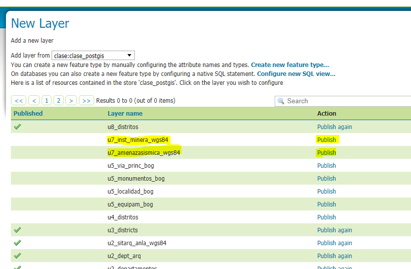

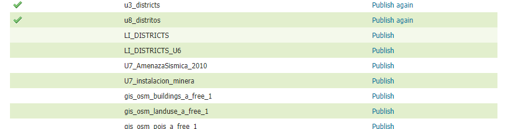

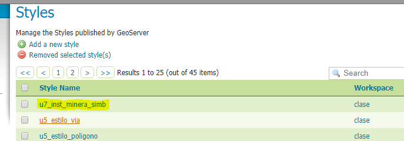

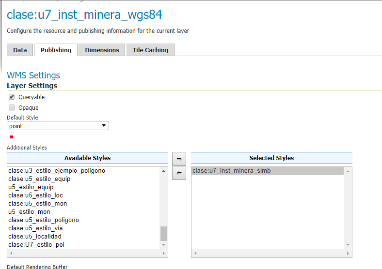

Con el grupo de layers, sencillamente queda determinar la url del wms 

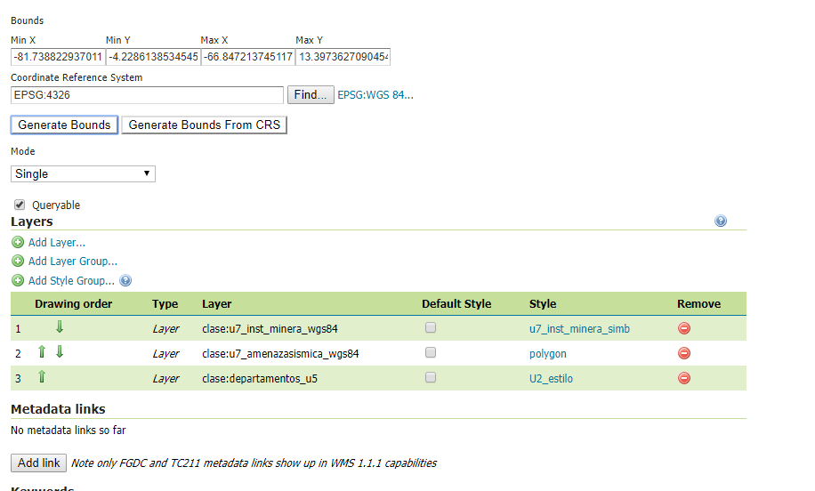

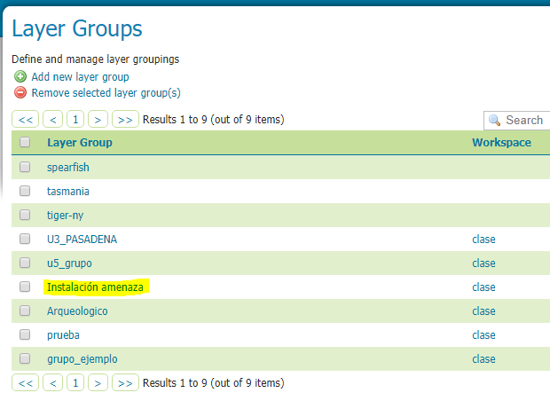

## Nombres de las tablas creadas en postgis

* u7_inst_minera_wgs84
* u7_amenazasismica_wgs84

## Nombres de las capas y estilos publicadas en geoserver.

__Capa-postgres__   

* u7_inst_minera_wgs84
* u7_amenazasismica_wgs84                                             

__Estilo__ 

* dp_simb_css
* amenaza_simb
* u7_inst_minera_simb

__Capa-GeoServer__

* u7_inst_minera_wgs84
* u7_amenazasismica_wgs84

## Url de la previsualización del grupo de capas en Geoserver

Url: http://34.83.176.208:18080/geoserver/clase/wms?service=WMS&version=1.1.0&request=GetMap&layers=clase%3AInstalaci%C3%B3n%20amenaza&bbox=-81.7388229370117%2C-4.22861385345459%2C-66.8472137451172%2C13.3973627090454&width=648&height=768&srs=EPSG%3A4326&format=application/openlayers

## Pantallazos con la forma en que los usuarios pueden consultar su geoservicio a través de QGIS

1. Se crea una conexion nueva al servicio:

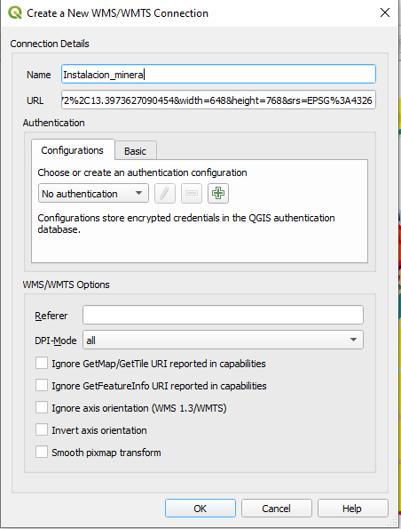

2. Definimos los detalles de la conexion con la Url

3. Luego de establecer la conexion, seleccionamos para que se agregue al Qgis el servicio Hallazgos Arqueologicos Col

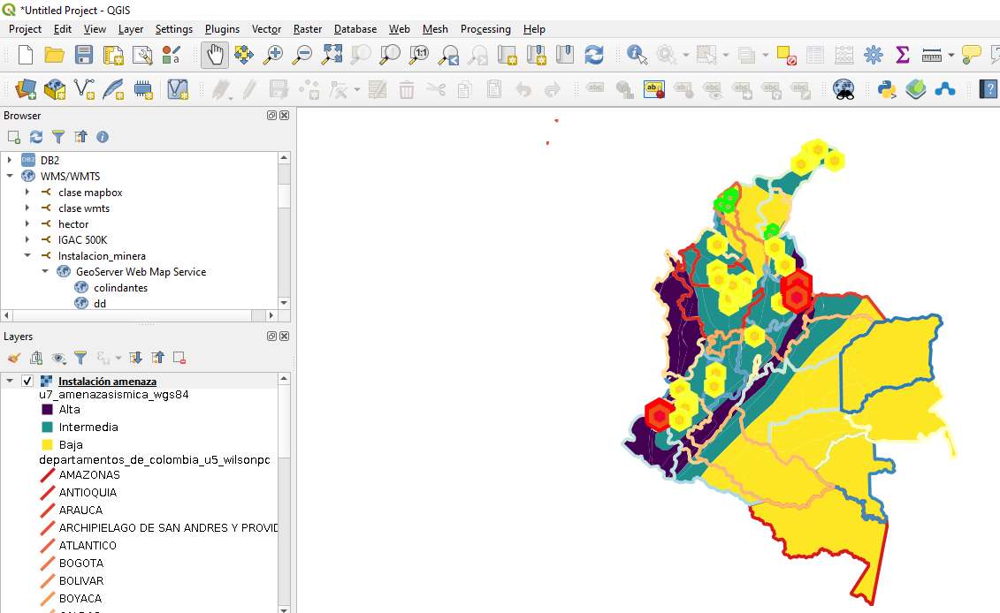

WMS: http://34.83.176.208:18080/geoserver/clase/wms?version=1.1.0&layers=clase%3Au7_grouplayer&bbox=-81.7388229370117%2C-4.22861385345459%2C-66.8472137451172%2C13.3973627090454&width=648&height=768&srs=EPSG%3A4326

## Ventajas / desventajas / dificultades encontradas durante el proceso

Las ventajas de saber como publicar nuestra propia información para poder expresar ideas es muy importante. La unica dificultad fuerte ue el implementar el codigo css a la simbologia y la consulta inicial por PgAdmin.
